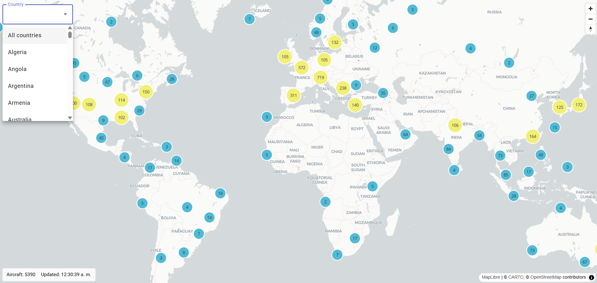
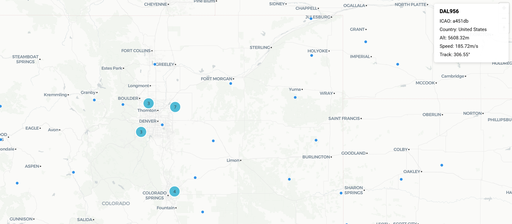

# ✈️ MapXV — Real-Time Aircraft Tracker

Angular 18 application that visualizes real-time aircraft positions on an interactive map using **MapLibre GL JS** and the **OpenSky Network API**.


---

## 📸 Screenshots

### Map View — Global aircraft with clustering


### Aircraft Detail Panel


---

## 🎯 Features

- **Real-time aircraft tracking** — Polls OpenSky Network every 90 seconds
- **Clustering** — Aggregates thousands of aircraft into clusters that expand on zoom
- **Country filter** — Dropdown to filter aircraft by origin country
- **Aircraft detail panel** — Click any aircraft to see callsign, ICAO24, altitude, speed, heading
- **Visibility-aware polling** — Pauses when the browser tab is hidden, resumes when visible
- **OAuth2 authentication** — Proxy handles token lifecycle automatically (refresh, retry)
- **OnPush change detection** — Signals-based reactivity with zero manual subscriptions

---

## 🏆 Bonus Features

- **Smooth position interpolation (WIP)**  
  Aircraft positions are animated between polling updates using `requestAnimationFrame`, improving visual continuity.

- **Clustering**  
  Efficient rendering of large datasets using MapLibre's native clustering — circles scale and color by density, with numeric labels. Clicking a cluster zooms in and expands it.

- **Country filtering**  
  Dropdown (Angular Material `mat-select`) to filter aircraft by origin country. Available countries are derived dynamically from live data via a computed signal.

---

## ⚙️ Prerequisites

- **Node.js** v18+
- **Angular CLI** v18+
- An **OpenSky Network** account with API credentials ([create one here](https://opensky-network.org/index.php?option=com_users&view=registration))

---

## 🚀 Installation & Running Locally

```bash
# 1. Install dependencies
npm install

# 2. Configure API credentials (see section below)
cp .env.example .env

# 3. Run the development server
ng serve
```

The app will be available at **http://localhost:4200**.

---

## 🔑 API Credentials Setup

OpenSky uses **OAuth2 client credentials** (Basic Auth is no longer accepted).

1. Log in at [opensky-network.org](https://opensky-network.org)
2. Go to **My OpenSky → Account** and create a new API client
3. Copy your `client_id` and `client_secret`
4. Create a `.env` file in the project root:

```env
OPENSKY_CLIENT_ID=your-client-id
OPENSKY_CLIENT_SECRET=your-client-secret
```

The dev proxy (`proxy.conf.js`) reads these at startup, fetches a Bearer token, and auto-refreshes it every 30 minutes. Credentials **never reach the browser**.

> Without credentials the app still works with anonymous access, but rate limits are much stricter (400 credits/day vs 4,000).

---

## 🏗️ Architecture

The project follows a **feature-based, layered architecture** with clear separation of concerns.

> 📖 For a deeper dive into signals, computed selectors, state management internals, and detailed data flow annotations, see [ARCHITECTURE.md](ARCHITECTURE.md).

```
src/app/
├── domain/              # Pure models & interfaces (no dependencies)
│   └── aircraft/
│       ├── aircraft.model.ts              # AircraftState, OpenSkyApiResponse, PositionSource
│       └── aircraft-geojson.model.ts      # AircraftFeatureProperties, GeoJSON types
│
├── data/                # Data access & transformation
│   └── aircraft/
│       ├── aircraft.adapter.ts            # API array → AircraftState (pure functions)
│       ├── aircraft.repository.ts         # HttpClient wrapper for OpenSky API
│       └── aircraft-geojson.mapper.ts     # AircraftState → GeoJSON FeatureCollection
│
├── state/               # Reactive state management (Signals)
│   └── aircraft/
│       └── aircraft.store.ts              # Normalized state, computed selectors, mutations
│
├── application/         # Orchestration (Facade pattern)
│   └── aircraft/
│       └── aircraft.facade.ts             # Coordinates polling, store, visibility
│
├── infrastructure/      # Cross-cutting concerns
│   ├── polling/
│   │   └── polling.service.ts             # Generic RxJS polling with retry & backoff
│   └── visibility/
│       └── visibility.service.ts          # Page Visibility API (pause when tab hidden)
│
├── shared/              # Reusable services & tokens
│   └── map/
│       ├── map.service.ts                 # MapLibre lifecycle, layers, sources, clustering
│       └── map.tokens.ts                  # MAP_CONFIG injection token
│
├── pages/               # Route-level smart components
│   └── map-view/
│       ├── map-view.component.ts          # Orchestrates facade ↔ map (OnPush)
│       ├── map-view.component.html        # Template: map, filters, detail panel
│       ├── map-view.component.css
│       └── map-container/
│           └── map-container.component.ts # MapLibre DOM host (AfterViewInit)
│
├── app.routes.ts        # Lazy-loaded routes
└── app.config.ts        # Providers (HttpClient, Router, Animations)
```

### Data Flow

```
OpenSky API → Proxy (Bearer token) → Repository → Adapter → Store (signals)
                                                                  ↓
                                              Facade ← Polling + Visibility
                                                ↓
                                       MapViewComponent (effect)
                                                ↓
                                     MapService.updateAircraftSource(geojson)
                                                ↓
                                         MapLibre GL (render)
```

### 🔄 How It Works

1. **Polling service** fetches aircraft data periodically (every 90 s, visibility-aware)
2. **Adapter** transforms raw API arrays into typed domain models, filtering invalid entries
3. **Store** updates normalized state (`Record<icao24, AircraftState>`) using Angular Signals
4. **GeoJSON** is derived automatically via `computed` selectors — no manual trigger needed
5. **MapService** updates the map source efficiently using `setData()` — layers are never recreated

---

## 🗺️ Map Configuration

| Setting | Value |
|---------|-------|
| Tile style | [CartoDB Positron](https://basemaps.cartocdn.com/gl/positron-gl-style/style.json) |
| Default center | `[0, 20]` (Atlantic, 20°N) |
| Default zoom | 2 (world view) |
| Cluster radius | 50 px |
| Cluster max zoom | 14 |

**Three map layers:**
1. `clusters-layer` — Circle markers sized/colored by cluster density
2. `cluster-count-layer` — Numeric labels on clusters
3. `aircraft-layer` — Individual aircraft icons (unclustered points)

---

## ⚡ Performance

| Optimization | Detail |
|---|---|
| **Polling interval** | 90 s (960 req/day × 4 credits = 3,840 — within 4,000/day limit) |
| **Visibility-aware** | Stops polling when tab is hidden |
| **OnPush** | All components use `ChangeDetectionStrategy.OnPush` |
| **Signals** | No manual subscriptions — computed selectors update reactively |
| **GeoJSON `setData`** | Source updated in-place — layers/sources never recreated |
| **Normalized state** | `Record<string, AircraftState>` for O(1) lookups |
| **Retry with backoff** | Exponential backoff inside `switchMap` — outer timer never dies |
| **Token warm-cache** | Bearer token refreshed 60 s before expiry — zero latency per request |

### API Credit Budget (Standard User — 4,000/day)

| Query type | Cost | Requests/day at 90s | Daily credits |
|---|---|---|---|
| Global (no bounding box) | 4 | 960 | 3,840 ✅ |
| Bounding box ≤ 25 sq° | 1 | 960 | 960 |
| Bounding box 25–100 sq° | 2 | 960 | 1,920 |

---

## � Key Technical Decisions

- **Signals over RxJS in UI layer**  
  Avoids manual subscriptions and reduces memory leaks.

- **Normalized state (`Record<icao24, AircraftState>`)**  
  Enables O(1) lookups and efficient updates.

- **MapLibre integration via MapService**  
  Prevents coupling between UI and rendering engine.

- **GeoJSON `setData()` updates**  
  Avoids re-creating layers, ensuring high performance.

- **Visibility-aware polling**  
  Reduces API usage and improves efficiency.

---

## �🧪 Testing

```bash
# Run all unit tests
ng test

# Run with coverage
ng test --code-coverage
```

Unit tests cover:
- **Adapter** — Raw API array → typed model transformation
- **Repository** — HTTP calls and error handling
- **GeoJSON mapper** — State → FeatureCollection conversion
- **Store** — Signal mutations, computed selectors, filtering

---

## 🧹 Linting

```bash
ng lint
```

Configured with **angular-eslint** + **prettier**.

---

## 📦 Tech Stack

| Category | Technology |
|----------|-----------|
| Framework | Angular 18 (standalone APIs) |
| Language | TypeScript 5.5 (strict mode) |
| State | Angular Signals + computed |
| Async | RxJS 7.8 (polling, HTTP) |
| Map | MapLibre GL JS 5.x |
| UI | Angular Material 18 |
| GeoJSON | `@types/geojson` |
| Auth | OAuth2 client credentials (proxy-side) |
| Testing | Karma + Jasmine |
| Linting | ESLint + Prettier |

---

## 📁 Environment Files

| File | Purpose | Committed |
|------|---------|-----------|
| `.env` | API credentials (`CLIENT_ID`, `CLIENT_SECRET`) | ❌ (gitignored) |
| `proxy.conf.js` | Dev proxy — reads `.env`, manages OAuth2 tokens | ✅ |
| `angular.json` | Build/serve config (references `proxy.conf.js`) | ✅ |

---

## 📄 License

Private project — not licensed for redistribution.